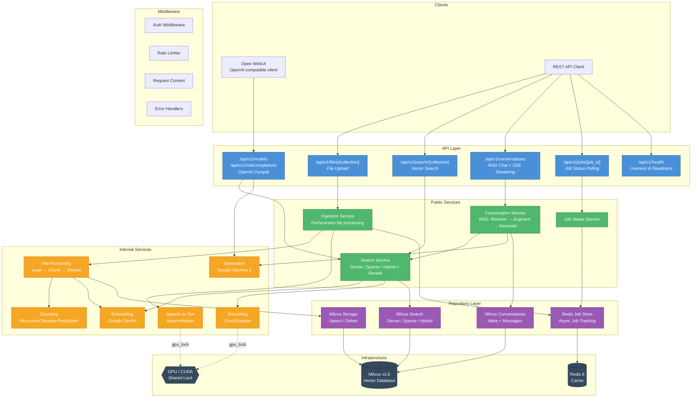
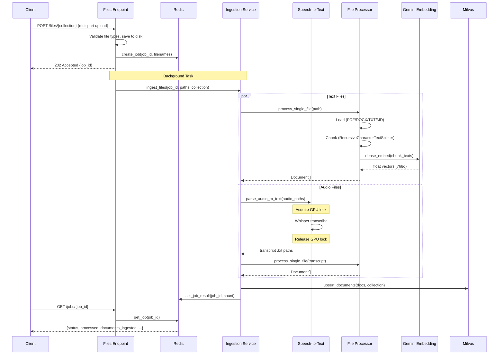
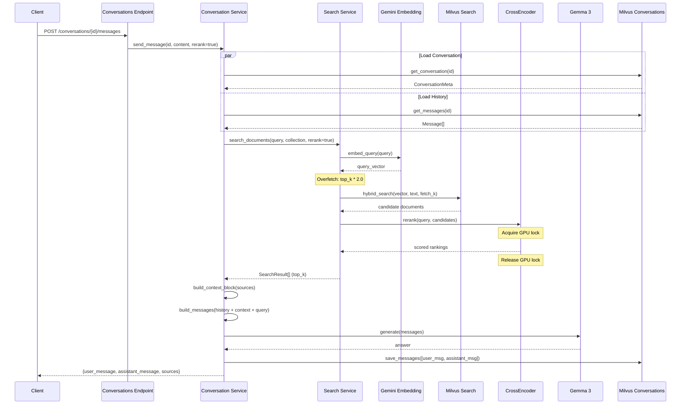
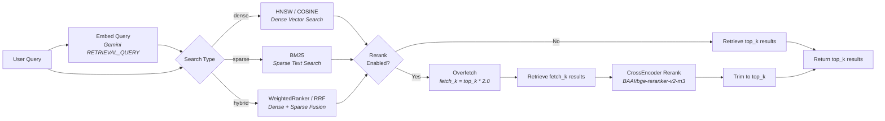
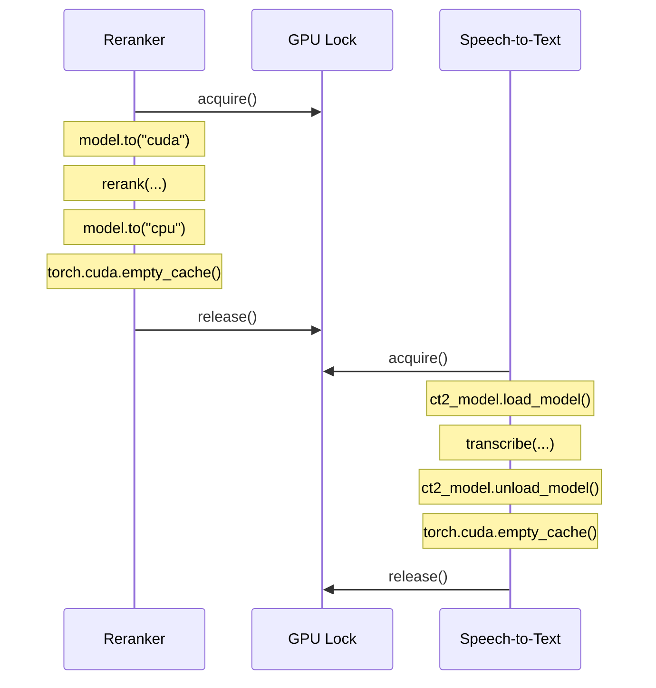
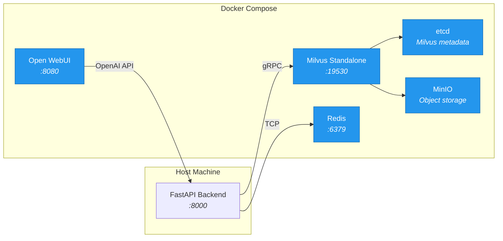

# Audio2Text RAG

A production-grade **Retrieval-Augmented Generation** system that ingests text and audio documents, builds a searchable vector store, and serves multi-turn conversational AI with source-grounded answers. Designed with a clean layered architecture, async-first concurrency, GPU memory safety, and drop-in OpenAI API compatibility for [Open WebUI](https://github.com/open-webui/open-webui) integration.

---

## Table of Contents

- [Getting Started](#getting-started)
- [Architecture Overview](#architecture-overview)
- [System Architecture Diagram](#system-architecture-diagram)
- [Project Structure](#project-structure)
- [Layer-by-Layer Breakdown](#layer-by-layer-breakdown)
  - [API Layer](#api-layer)
  - [Schema Layer](#schema-layer)
  - [Middleware Layer](#middleware-layer)
  - [Service Layer — Public](#service-layer--public)
  - [Service Layer — Internal](#service-layer--internal)
  - [Repository Layer](#repository-layer)
  - [Core Infrastructure](#core-infrastructure)
- [Key Data Flows](#key-data-flows)
  - [Document Ingestion Pipeline](#document-ingestion-pipeline)
  - [RAG Conversation Pipeline](#rag-conversation-pipeline)
  - [Search Pipeline with Reranking](#search-pipeline-with-reranking)
- [Concurrency and GPU Management](#concurrency-and-gpu-management)
- [Technology Stack](#technology-stack)
- [Infrastructure & Deployment](#infrastructure--deployment)
- [Configuration Reference](#configuration-reference)

---

## Getting Started

### Prerequisites

- Python 3.13+
- [uv](https://docs.astral.sh/uv/) package manager
- Docker and Docker Compose
- NVIDIA GPU with CUDA support (optional, for reranking and transcription)

This starts Milvus, Redis, and Open WebUI.

### 1. Install Dependencies

```bash
uv sync
```

### 2. Configure Environment

```bash
cp .env.example .env
# Edit .env with your API keys:
#   GOOGLE_API_KEY=...
```

### 3. Setup Infrastructure + Run the Backend

```bash
docker compose up -d

uv run uvicorn app.main:app --host 0.0.0.0 --port 8000
```

if you have `just` installed, just simply run:

```bash
just
```

The API documentation is available at `http://localhost:8000/docs`.

### 4. Run Tests (Optional)

```bash
uv run pytest
```

### 5. Use Open WebUI

Open WebUI will be available at `http://localhost:8080`. It is preconfigured to use the FastAPI backend as its OpenAI provider, so you can start a conversation right away!

---

## Architecture Overview

The system follows a strict **four-layer architecture** with unidirectional dependencies:

```
API Endpoints -> Public Services -> Internal Services -> Repositories
```

Each layer has a single responsibility:

| Layer                 | Responsibility                                         | Examples                             |
| --------------------- | ------------------------------------------------------ | ------------------------------------ |
| **API**               | HTTP routing, request validation, response formatting  | REST endpoints, OpenAI-compat API    |
| **Public Services**   | Business orchestration, workflow coordination          | Ingestion pipeline, RAG chat, search |
| **Internal Services** | Atomic capabilities (embedding, generation, reranking) | Gemini embedding + LLM, CrossEncoder |
| **Repositories**      | Data access and persistence                            | Milvus vector DB, Redis job store    |

Cross-cutting concerns (configuration, logging, GPU locking, error handling) live in `app/core/` and `app/middleware/`.

---

## System Architecture Diagram



---

## Project Structure

```
app/
├── main.py                          # FastAPI application factory
├── core/
│   ├── config.py                    # Pydantic Settings (env-driven)
│   ├── gpu.py                       # Shared GPU threading lock
│   └── logging.py                   # Context-aware logging with request IDs
├── api/
│   ├── openai_compat.py             # OpenAI-compatible /v1/* endpoints
│   └── v1/
│       └── endpoints/
│           ├── health.py            # GET /health, GET /ready
│           ├── files.py             # POST /files/{collection}
│           ├── jobs.py              # GET /jobs/{job_id}
│           ├── search.py            # POST /search/{collection}
│           └── conversations.py     # Conversation CRUD + RAG messaging
├── schemas/
│   ├── files.py                     # FileIngestionResponse, FileResult
│   ├── jobs.py                      # JobStatusResponse, FileJobStatus
│   ├── search.py                    # SearchRequest, SearchResult, SearchResponse
│   └── conversations.py            # Conversation & message request/response schemas
├── models/
│   ├── doc.py                       # Document domain model
│   └── conversation.py              # Message, ConversationMeta domain models
├── middleware/
│   ├── auth.py                      # Static API key authentication
│   ├── rate_limit.py                # Sliding-window rate limiter
│   ├── request_context.py           # Request ID injection + duration logging
│   └── errors.py                    # ApiError base class + exception handlers
├── services/
│   ├── public/
│   │   ├── ingest.py                # File ingestion orchestrator
│   │   ├── search.py                # Search dispatcher + reranking
│   │   ├── conversations.py         # RAG conversation orchestrator
│   │   └── job_status.py            # Job polling wrapper
│   └── internal/
│       ├── chunk.py                 # Text splitting + LLM title generation
│       ├── embed.py                 # Google Gemini dense embeddings
│       ├── generate.py              # Google Gemini (Gemma 3) generation (stream + sync)
│       ├── rerank.py                # CrossEncoder reranking with GPU lifecycle
│       ├── speech_to_text.py        # faster-whisper transcription with GPU lifecycle
│       └── process_files.py         # End-to-end file processing pipeline
├── repositories/
│   ├── milvus/
│   │   ├── _client.py               # MilvusClient singleton
│   │   ├── _collection.py           # Collection schema + index creation
│   │   ├── storage.py               # Document upsert / delete
│   │   ├── search.py                # Dense, sparse, hybrid search
│   │   └── conversations.py         # Conversation + message persistence
│   └── redis/
│       ├── _client.py               # Redis client singleton
│       └── job_store.py             # Job lifecycle tracking
└── utils/
    ├── save_upload.py               # File upload persistence
    └── download.py                  # yt-dlp audio downloader

tests/
├── test_search.py                   # 58 tests — search service + endpoints
├── test_conversations.py            # 85 tests — conversation CRUD + RAG
├── test_openai_compat.py            # OpenAI compatibility layer tests
├── test_ingestion.py                # File ingestion pipeline tests
└── test_db.py                       # Milvus repository integration tests

compose.yaml                         # Docker Compose (Milvus, Redis, Open WebUI)
pyproject.toml                       # Project metadata + dependencies (uv)
```

---

## Layer-by-Layer Breakdown

### API Layer

The API layer handles HTTP routing, request deserialization, and response formatting. It contains no business logic.

**REST API (`/api/v1/`)**

| Endpoint                              | Method | Description                                             |
| ------------------------------------- | ------ | ------------------------------------------------------- |
| `/api/v1/health`                      | GET    | Liveness probe                                          |
| `/api/v1/ready`                       | GET    | Readiness probe                                         |
| `/api/v1/files/{collection_name}`     | POST   | Upload files for async ingestion (returns 202 + job ID) |
| `/api/v1/jobs/{job_id}`               | GET    | Poll ingestion job progress                             |
| `/api/v1/search/{collection_name}`    | POST   | Execute vector search (dense/sparse/hybrid)             |
| `/api/v1/conversations`               | POST   | Create a new RAG conversation                           |
| `/api/v1/conversations`               | GET    | List conversations (filterable by collection)           |
| `/api/v1/conversations/{id}`          | GET    | Get conversation with full message history              |
| `/api/v1/conversations/{id}`          | DELETE | Delete conversation and all messages                    |
| `/api/v1/conversations/{id}/messages` | POST   | Send message and receive RAG-augmented response         |

**OpenAI-Compatible API (`/v1/`)**

Allows Open WebUI to use the RAG backend as a standard LLM provider:

| Endpoint                   | Method | Description                                                  |
| -------------------------- | ------ | ------------------------------------------------------------ |
| `/api/v1/models`           | GET    | Lists Milvus collections as models (`rag/{collection_name}`) |
| `/api/v1/chat/completions` | POST   | Full RAG pipeline with OpenAI-format streaming (SSE)         |

### Schema Layer

Pydantic v2 models for request validation and response serialization. Separated from domain models to decouple the API contract from internal representations.

Key schemas:

- **`SearchRequest`** — `query`, `top_k`, `search_type` (dense/sparse/hybrid), `rerank`, `language`
- **`SendMessageRequest`** — `content`, `search_type`, `top_k`, `stream`, `rerank`
- **`SearchResult`** — `doc_id`, `title`, `text`, `score`, `metadata`
- **`SendMessageResponse`** — paired `user_message` + `assistant_message` with sources

### Middleware Layer

Pluggable HTTP middleware for cross-cutting concerns:

| Middleware          | Purpose                                                                          |
| ------------------- | -------------------------------------------------------------------------------- |
| **Authentication**  | Static API key validation via `Authorization: Bearer` or `X-API-Key` header      |
| **Rate Limiting**   | In-memory sliding-window rate limiter (configurable requests/window per IP+path) |
| **Request Context** | UUID request ID injection, request duration logging                              |
| **Error Handling**  | Structured JSON error responses with `ApiError` hierarchy and request ID tracing |

### Service Layer — Public

Orchestration services that coordinate multiple internal services and repositories to fulfill business operations. Each public service function is `async` and offloads blocking I/O via `asyncio.run_in_executor`.

**Ingestion Service** (`ingest.py`)

- Splits uploads into text files and audio files
- Processes both branches **concurrently** via `asyncio.gather`
- Audio files: GPU-serialized transcription, then processed as text
- Updates Redis job status at each stage (queued → processing → completed/failed)

**Search Service** (`search.py`)

- Dispatches to dense (HNSW/COSINE), sparse (BM25), or hybrid search
- **Overfetch + rerank**: when enabled, fetches `OVERFETCH_MULTIPLIER * top_k` candidates, then applies CrossEncoder reranking to return the best `top_k`

**Conversation Service** (`conversations.py`)

- Full RAG pipeline: **Retrieve → Augment → Generate → Persist**
- Supports both synchronous responses and **Server-Sent Events (SSE) streaming**
- Auto-generates conversation titles from the first user message
- Trims conversation history to a configurable window before sending to the LLM

### Service Layer — Internal

Atomic, single-responsibility services that encapsulate individual ML/AI capabilities:

| Service              | Responsibility                                                   | Provider                |
| -------------------- | ---------------------------------------------------------------- | ----------------------- |
| **Chunking**         | `RecursiveCharacterTextSplitter` with configurable overlap       | LangChain               |
| **Title Generation** | LLM-powered chunk title generation                               | Google Gemma 3          |
| **Embedding**        | Asymmetric dense embeddings (separate document/query task types) | Google Gemini           |
| **Generation**       | RAG answer generation (streaming + non-streaming)                | Google Gemma 3          |
| **Reranking**        | Cross-encoder relevance scoring with GPU lifecycle management    | BAAI/bge-reranker-v2-m3 |
| **Speech-to-Text**   | Batched audio transcription with GPU lifecycle management        | faster-whisper          |
| **File Processing**  | End-to-end pipeline: load → chunk → title → embed → Document     | Composite               |

### Repository Layer

Data access layer that abstracts all persistence concerns. Each repository module exposes pure functions — no business logic.

**Milvus Repositories:**

- **Search** — `dense_search()`, `sparse_search()`, `hybrid_search()` with configurable fusion (Weighted/DBSF ranker or RRF ranker)
- **Storage** — `upsert_documents()`, `delete_documents()` with auto-collection creation
- **Conversations** — Two-collection design (`_conversation_meta`, `_conversation_messages`) with full CRUD
- **Collection Schema** — Dense vector (FLOAT_VECTOR, 768d, HNSW index), sparse vector (SPARSE_FLOAT_VECTOR, BM25 function), plus metadata fields

**Redis Repository:**

- **Job Store** — Hash-based job tracking with per-file granularity at `job:{id}` and `job:{id}:files:{filename}`, with 1-hour TTL auto-expiry

### Core Infrastructure

| Module       | Purpose                                                                          |
| ------------ | -------------------------------------------------------------------------------- |
| `config.py`  | Centralized `pydantic-settings` configuration loaded from `.env` with validation |
| `gpu.py`     | Shared `threading.Lock` preventing GPU OOM between reranker and speech-to-text   |
| `logging.py` | `contextvars`-based request ID propagation with structured logging               |

---

## Key Data Flows

### Document Ingestion Pipeline



### RAG Conversation Pipeline



### Search Pipeline with Reranking



---

## Concurrency and GPU Management

### Async Architecture

All API endpoints are `async`. Every blocking operation (Milvus queries, embedding API calls, LLM generation, file I/O) is offloaded to the default thread-pool executor via `asyncio.run_in_executor`, ensuring the event loop remains responsive under concurrent load.

```python
# Pattern used throughout the codebase:
async def search_documents(query, collection_name, ...):
    loop = asyncio.get_running_loop()
    query_vector = await embed_query(query)                          # async
    hits = await loop.run_in_executor(None, _run_hybrid_search, ...) # offloaded
    rankings = await loop.run_in_executor(None, _rerank_sync, ...)   # offloaded
```

### GPU Memory Safety

The system is designed to run on machines with limited GPU VRAM (4 GB). Two services require exclusive GPU access:

1. **Reranker** (CrossEncoder) — loads model to CUDA, reranks, moves back to CPU, frees VRAM
2. **Speech-to-Text** (faster-whisper) — loads CTranslate2 weights to CUDA, transcribes, unloads

A single `threading.Lock` in `app/core/gpu.py` serializes GPU access:



---

## Technology Stack

| Category              | Technology                               | Purpose                                                |
| --------------------- | ---------------------------------------- | ------------------------------------------------------ |
| **Framework**         | FastAPI + Uvicorn                        | Async HTTP server with OpenAPI docs                    |
| **Validation**        | Pydantic v2                              | Request/response schemas and domain models             |
| **Vector Database**   | Milvus 2.6                               | Dense (HNSW) + sparse (BM25) vector storage and search |
| **Cache / Job Store** | Redis 8                                  | Async job tracking with TTL-based expiry               |
| **Embeddings**        | Google Gemini (`gemini-embedding-001`)   | 768-dimensional asymmetric embeddings                  |
| **LLM**               | Google Gemma 3 (`gemma-3-27b-it`)        | RAG answer generation and title generation             |
| **Reranking**         | `BAAI/bge-reranker-v2-m3` (CrossEncoder) | Cross-encoder relevance scoring                        |
| **Speech-to-Text**    | faster-whisper (CTranslate2)             | Batched audio transcription                            |
| **Text Processing**   | LangChain                                | Document loaders (PDF, DOCX, TXT) and text splitting   |
| **Streaming**         | SSE (sse-starlette)                      | Token-by-token response streaming                      |
| **UI**                | Open WebUI v0.8                          | Chat interface via OpenAI-compatible API               |
| **Package Manager**   | uv                                       | Fast Python dependency management                      |
| **Containerization**  | Docker Compose                           | Milvus + etcd + MinIO + Redis + Open WebUI             |

---

## Infrastructure & Deployment



The `compose.yaml` provisions the full infrastructure stack:

- **Milvus Standalone** with etcd (metadata) and MinIO (object storage) backends
- **Redis** with AOF persistence and password authentication
- **Open WebUI** configured to use the FastAPI backend as its OpenAI provider

---

## Configuration Reference

All settings are managed via environment variables (`.env` file), loaded through `pydantic-settings`:

| Variable                      | Default                       | Description                                        |
| ----------------------------- | ----------------------------- | -------------------------------------------------- |
| `GOOGLE_API_KEY`              | —                             | Google API key for Embeddings + Generation         |
| `MAX_TOKENS`                  | `1024`                        | Maximum chunk size (characters)                    |
| `OVERLAP_TOKENS`              | `200`                         | Overlap between consecutive chunks                 |
| `EMBEDDING_MODEL`             | `models/gemini-embedding-001` | Gemini embedding model                             |
| `EMBEDDING_DIM`               | `768`                         | Embedding vector dimensionality                    |
| `FUSION_METHOD`               | `weighted`                    | Hybrid search fusion: `weighted`, `dbsf`, or `rrf` |
| `FUSION_ALPHA`                | `0.7`                         | Dense vs sparse weight (1.0 = all dense)           |
| `RERANKER_MODEL`              | `BAAI/bge-reranker-v2-m3`     | CrossEncoder model for reranking                   |
| `OVERFETCH_MULTIPLIER`        | `2.0`                         | Overfetch factor before reranking                  |
| `GENERATION_MODEL`            | `gemma-3-27b-it`              | LLM model for RAG generation                       |
| `GENERATION_SEARCH_TYPE`      | `hybrid`                      | Default search type for RAG                        |
| `GENERATION_RAG_TOP_K`        | `5`                           | Documents retrieved per query                      |
| `GENERATION_HISTORY_TURNS`    | `10`                          | Max conversation turns sent to LLM                 |
| `MILVUS_URI`                  | `http://localhost:19530`      | Milvus connection URI                              |
| `REDIS_HOST`                  | `localhost`                   | Redis host                                         |
| `REDIS_PORT`                  | `6379`                        | Redis port                                         |
| `OPENWEBUI_RERANKING_ENABLED` | `True`                        | Enable reranking for Open WebUI queries            |
